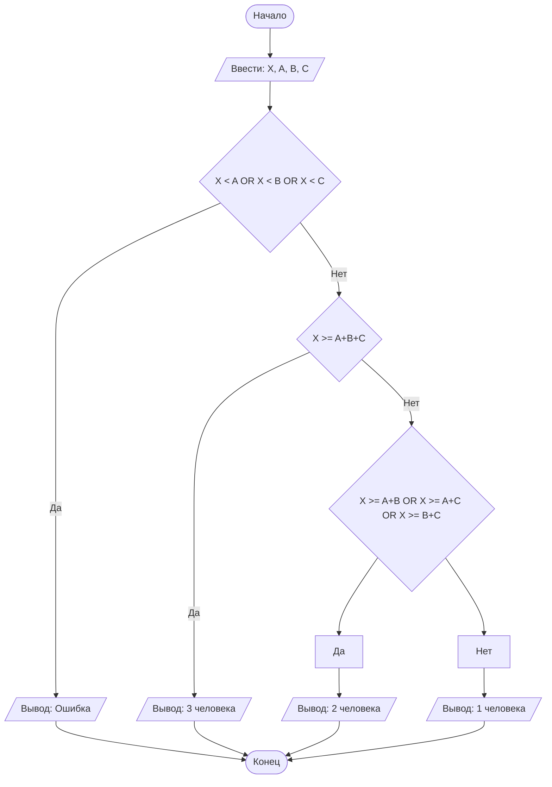

## Отчет по лабораторной работе № 1

#### № группы: `ПМ-2401`

#### Выполнил: `Реученко Яна Антоновна`

#### Вариант: `23`

### Cодержание:

- [Постановка задачи](#1-постановка-задачи)
- [Входные и выходные данные](#2-входные-и-выходные-данные)
- [Выбор структуры данных](#3-выбор-структуры-данных)
- [Алгоритм](#4-алгоритм)
- [Программа](#5-программа)
- [Анализ правильности решения](#6-анализ-правильности-решения)

### 1. Постановка задачи

>  В лифте с максимальной грузоподъемностью Х кг находятся три человека с весом А, В, С кг. Необходимо определить, скольких человек лифт сможет поднять одновременно, не превышая допустимую нагрузку. На вход программы подаются натуральные числа Х, А, В, С.

Найти максимальное количество людей, сумма веса которых не превышает грузоподъемность лифта. Для этого проверим не превышает ли сумма веса троих людей грузоподъемность лифта, а если превышает, то проверим, имеется ли такая пара людей, сумма веса  которых будет удовлетворять условию задачи. Если ни одно из описанных ранее условий не выполняется, то значит что лифт не может перевезти более одного человека за раз. 

Дополнительное условие: считаем, что вес любого человека не может превышать грузоподъемность лифта.

### 2. Входные и выходные данные

#### Данные на вход

На вход программа должна получать 4 натуральных числа.

*Диапазон значений для всех указанных входных данных – область натуральных чисел (0; +бесконечности) в пределах разумного =) предположим, что максимальный вес одного человека 200 кг, а максимальная грузоподъемность лифта 500 кг (программа обрабатывает и другие значения на области натуральных чисел)*


|             | Тип                | Значение  (кг)         |
|-------------|--------------------|------------------------|
| X (Число 1) | Целое число | Грузоподъемность лифта 
| A (Число 2) | Целое число | Вес первого человека   |
| B (Число 2) | Целое число | Вес  второго человека  |
| C (Число 3) | Целое число | Вес третьего человека  |

#### Данные на выход

Человекочитаемая строка, в которой указано максимальное количество человек, которых может одновременно поднять лифт. Минимальное количество человек – 1, максимальное – 3 (по условию задачи).

В случае ввода ошибочных данных (вес одного из людей превышает макс грузоподъемность лифта), будет выведено сообщение об ошибке.


### 3. Выбор структуры данных

Для храниния введенных из консоли данных нам необходимо 4 переменных типа Int, так как по условию задачи все входные данные - натуральные числа

|             | название переменной | Тип (в Java) | 
|-------------|---------------------|--------------|
| X (Число 1) | `X`                 | `int`        |
| A (Число 2) | `A`                 | `int`        |
| B (Число 2) | `B`                 | `int`        |
| C (Число 2) | `C`                 | `int`        |


### 4. Алгоритм

#### Алгоритм выполнения программы:

1. **Ввод данных:**  
   Программа считывает четыре целых числа, обозначенные как `X`, `A`, `B` и `C`.

2. **Проверка ограничения на превышение веса человека:**  
   Программа сравнивает значения `A`, `B` и `C` с `Х`. Если `Х` меньше хотя бы одного из значений  переменных, программа выведет сообщение об ошибке.

3. **Проверка может ли перевезти троих людей одновременно:**
   Сравниваем сумму значение переменных `A`, `B` и `C` с `Х`. Если `Х` больше суммы, то выводим ответ - 3 человека

4. **Проверка может ли перевезти двоих людей одновременно:**
   Сравниваем суммы значение переменных всех попарных сочетаний переменных `A`, `B` и `C` с `Х`. . Если `Х` больше любой из сумм, то выводим ответ - 2 человека

5. **Вывод, что может  перевезти только одного человека:**
   Если ни одно из предыдущих условий не выполнилось, выводим ответ - 1 человек.

#### Блок-схема



### 5. Программа

```java
import java.io.PrintStream;
import java.util.Scanner;
public class Main {
   public static Scanner in = new Scanner(System.in);
   public static PrintStream out = System.out;
   public static void main(String[] args)  {

      // на экран выводится данная строка (указание действия для пользователя)
      System.out.println("Максимальная грузоподъемность лифта:");
      // пользователь вводит с клавиатуры максимальную грузоподъемность лифта
      int X = in.nextInt();
      // на экран выводится данная строка (указание действия для пользователя)
      System.out.println("Вес первого человека:");
      // пользователь вводит с клавиатуры вес первого человека
      int A = in.nextInt();
      // на экран выводится данная строка (указание действия для пользователя)
      System.out.println("Вес второго человека:");
      // пользователь вводит с клавиатуры вес второго человека
      int B = in.nextInt();
      // на экран выводится данная строка (указание действия для пользователя)
      System.out.println("Вес третьего человека:");
      // пользователь вводит с клавиатуры вес третьего человека
      int C = in.nextInt();
      // условный оператор проверяет, что вес ни одного из людей не превышает макс грузоподъемность лифта
      if (X<A || X<B || X<C)
         out.println("Вес одного человека не может превышать грузоподъемность лифта!");
         // вес каждого человека не превышает
      else
         //проверяем может ли перевести троих людей
         if (X >= A+B+C)
            out.println("3 человека");
            //если не может перевести
         else
            //проверяем может ли перевести одну из пар людей
            if (X >= A+B || X >= A+C || X >= B+C)
               out.println("2 человека");
               //может перевести только одного человека
            else
               out.println("1 человека");
   }
}
```

### 6. Анализ правильности решения

Программа работает корректно на всем множестве решений с учетом ограничений.

1. Тест на `вес одного из людей превышает максимальную грузоподъемность лифта`:

    - **Input**:
        ``` 
        10 11 9 8
        ```

    - **Output**:
        ```
        Вес одного человека не может превышать грузоподъемность лифта!
        ```

2. Тест на `то что может поднять только одного человека`:

    - **Input**:
        ```
        10 9 8 7
        ```

    - **Output**:
        ```
        1 человека
        ```

3. Тест на `то что может поднять двоих людей`:

    - **Input**:
        ```
        10 9 5 4
        ```

    - **Output**:
        ```
        2 человек
        ```

4. Тест на `то что может поднять всех троих`:

    - **Input**:
        ```
        10 2 3 4
        ```

    - **Output**:
        ```
        3 человек
        ```